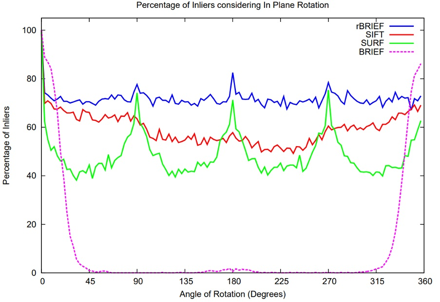
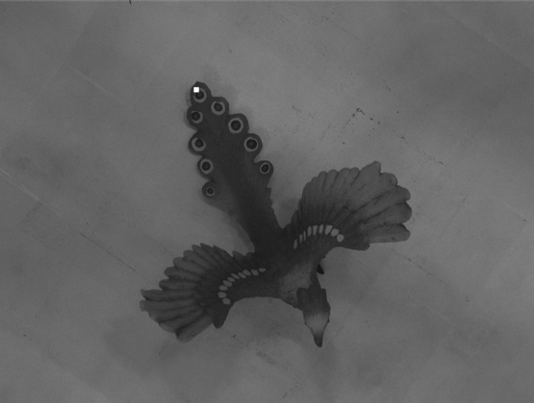
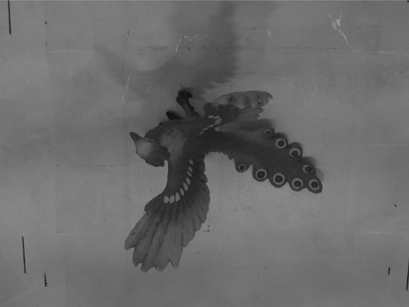
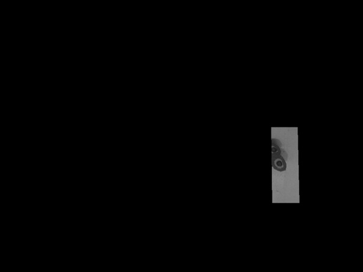
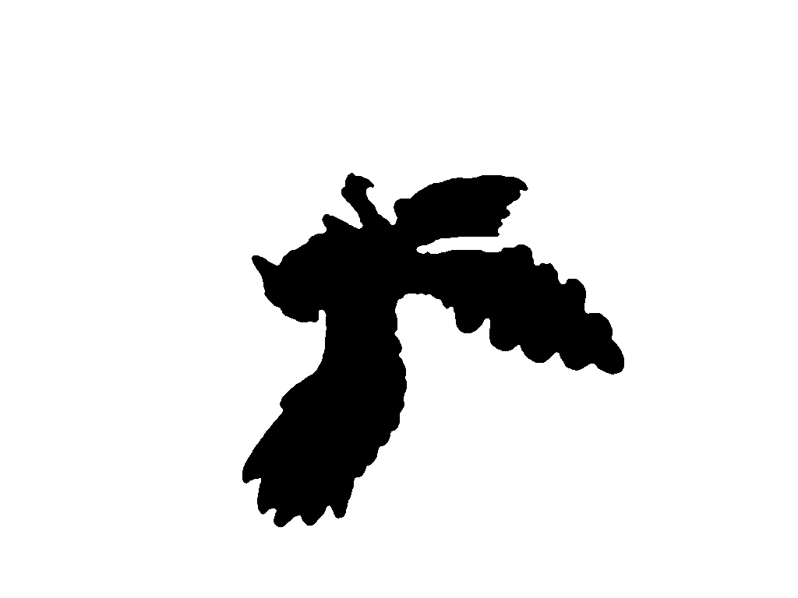
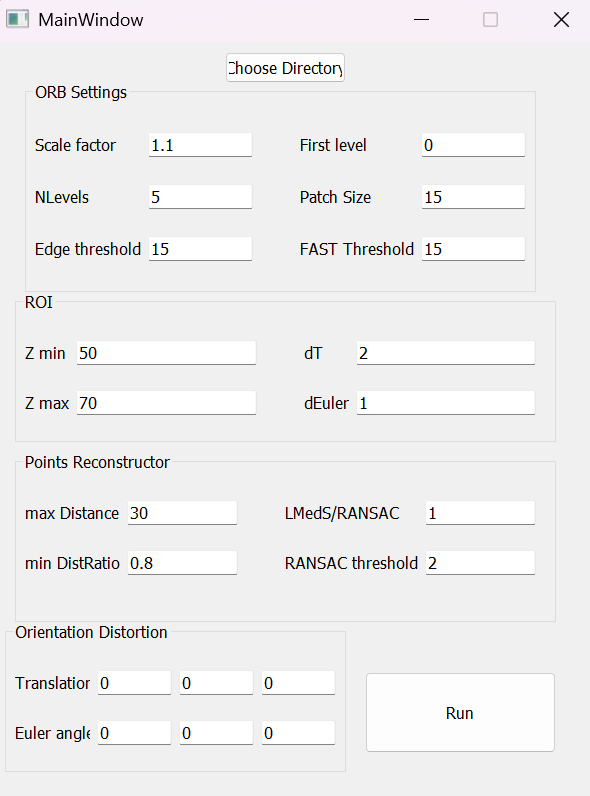
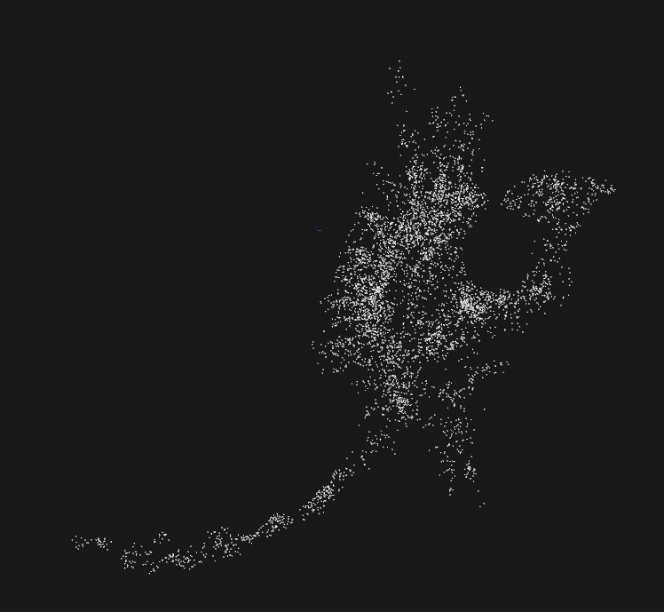
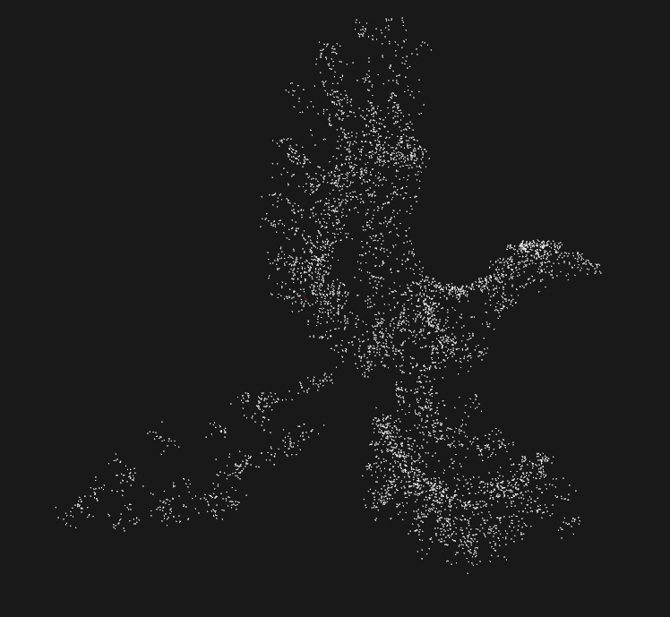
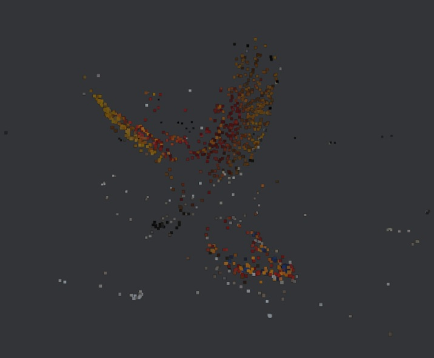
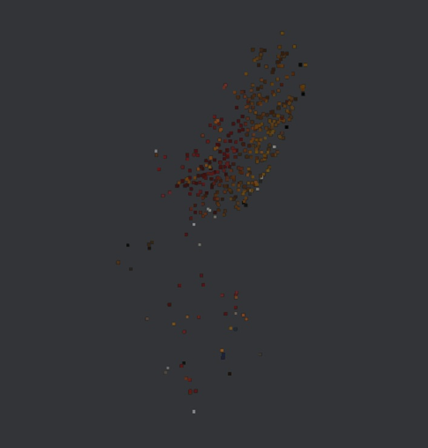

# 3D Reconstruction using SfM with Geometric Constraints

This project performs 3D scene reconstruction using Structure-from-Motion (SfM), supported by additional geometric hints that stabilize pose estimation and narrow down the correspondence search space.

### Used constraints:
- Approximate camera orientation/position (Euler angles and translation direction),
- Approximate object-to-camera depth range,
- Known camera intrinsics (K matrix, extracted from projection).

---

## System Overview

The system accepts a pair (or a small set) of images, along with intrinsics, masks, and auxiliary parameters.

The pipeline includes:
- Keypoint detection and matching,
- Epipolar geometry estimation,
- (R, t) selection,
- 3D point triangulation,
- Point cloud visualization.

---

## Implementation Summary

- A Qt GUI was developed to load data, adjust parameters, and preview results,
- Key SfM components were implemented in C++ using OpenCV and PCL,
- A matching mask was added to limit candidate regions in the right image using projections of the point across the depth interval and pose uncertainty (via grid + point-in-polygon test), improving matching precision.

---

## User-provided constraints
To increase robustness and reduce false matches in SfM, the system leverages auxiliary data supplied by the user:
- Z-axis camera rotation - Instead of relying only on ORB's rotation invariance, all keypoints are aligned with a common orientation derived from the camera's approximate Z-axis rotation. This reduces descriptor ambiguity when repeated patterns are present. The picture below (from [1]) shows comparison of the robustness of different descriptors depending on uncorrelated angle of Z-axis camera rotation.

- Coarse camera orientation and depth hints - Using approximate pose (Euler angles, translation) and expected object depth, the matching search space is narrowed to a region of interest (ROI). This significantly improves correspondence filtering and reduces runtime. 

<table>
   <tr>
      <td>
         <b>Source image with marked key point</b><br>
         
      </td>
      <td>
         <b>Target image</b><br>
         
      </td>
      <td>
         <b>ROI</b><br>
         
      </td>
   </tr>
</table>

- Masks - Binary masks are used in two ways:
   - Preprocessing: removing the background before keypoint detection and applying local histogram equalization inside the ROI.
   - Filtering: eliminating 3D points that project outside the object mask after triangulation.




These constraints act as geometric priors that stabilize reconstruction, especially in scenes with low texture or repeated patterns.

---


## Tech Stack

- C++17
- Qt (tested on 5.15.2)
- OpenCV (modules: `highgui`, `calib3d`, `cudaimgproc`, `cudafilters`, `imgcodecs`, `features2d`, `core`)
- PCL (with OpenNI2 support)
- CUDA (optional)
- OpenMP (optional)

---

## Current Scope (MVP)

- Input: small number of paired images
- Output: **sparse 3D reconstruction**
- No **global bundle adjustment** (planned for future)
- Focus on **matching accuracy** and **triangulation stability**
- Filtering: using matching mask + **radius-based filter**
- Export and view point clouds (via PCL)

---

## Limitations and Planned Work

**Known limitations:**
- No bundle adjustment or dense reconstruction yet - only sparse SfM pipeline is implemented.
- The codebase has a partially legacy structure - written several years ago and requires cleanup and modularization.
- Camera parameters are currently passed as a 3x4 projection matrix and decomposed internally. A more intuitive input format (K, R, t) is planned.
- CMake bug workaround: after generation, the `C/C++ Preprocessor Definition` value `"BOOST_ALL_NO_LIB-DBOOST_ALL_NO_LIB"` must be manually corrected to `"BOOST_ALL_NO_LIB"` (PCL-related issue).
- No input validation: the program does not check for invalid entries (e.g., strings instead of numbers).
- OpenCV interprets Euler angles with a sign flip, which may affect rotation-dependent components.
- The PCL visualizer has no preset camera configuration - the user must manually adjust the view.
- The GUI still contains remnants of deprecated functionality (e.g., unused shift controls), and several parameters are hardcoded instead of user-configurable.

**Planned improvements:**
- Add relative quality metrics: inlier ratio, reprojection error, matching time, and point density.
- Enable optional use of pose/hint data (currently required).
- Improve masking logic for performance - current implementation is unoptimized and slow for large keypoint sets.
- Ground-truth comparison.
- General cleanup for better maintainability and extendability.

---

## Installation Guide

> **Tested on Windows 11 × MSVC 2022**.  

---

### 1.  Pre-built Dependencies

| Library | Tested version | Notes |
|---------|---------|-------|
| **Qt** | 5.15.2 | Widgets module is enough. |
| **OpenCV** | 4.5 + opencv_contrib | Build both Debug and Release configurations. Required modules: `core`, `highgui`, `calib3d`, `features2d`, `imgcodecs`, `cudaimgproc`, `cudafilters`. |
| **PCL** | 1.12 with OpenNI2 | The official *All-in-One* installer works. Components needed by CMake: `common`, `io`, `filters`, `visualization`. |
| **CUDA** | Toolkit matching your GPU driver | - |

---

### 2.  Recommended Environment Variables *(Windows)*

| Variable | Purpose |
|----------|---------|
| `Qt5_DIR` <br>*(or `QTDIR`)* | Folder with **Qt5Config.cmake** (e.g. `C:\Qt\5.15.2\msvc2019_64`) |
| `OpenCV_DIR` | Folder with **OpenCVConfig.cmake** (e.g. `C:\opencv\build`) |
| `PCL_DIR` | Folder with **PCLConfig.cmake** (e.g. `C:\PCL\1.11.1\cmake`) |

> If `OpenNI2` is on your system, add its `Redist` directory to `Path` so PCL plugins can load.  
> No other variables are required; `find_package` in CMake will pick everything up.

---

### 3.  Build Steps

```powershell
# PowerShell / cmd
git clone https://github.com/your-org/3D_Reconstruction.git
cd 3D_Reconstruction

# Configure out-of-source build
cmake -S . -B build -G "Visual Studio 17 2022" ^
      -DCMAKE_BUILD_TYPE=Release      # omit for multi-config generators

# Build (Debug & Release, multi-config) 
cmake --build build --config Release
cmake --build build --config Debug    # optional

# run
build\Release\3D_Reconstruction.exe
```
---

## Application Usage

The user interacts with the application via the Qt GUI.

### Steps:

1. Click **"Choose Directory"** and select the folder containing all input data.  
   Each image must have three associated files with the same name and different extensions:
   - `.png` — input image  
   - `.jpg` — mask  
   - `.txt` — projection matrix

2. Set reconstruction parameters:

#### ORB-related parameters:
- **Scale factor** – image pyramid scale factor
- **First level** – first level of the pyramid
- **NLevels** – number of pyramid levels
- **Patch size** – BRIEF patch radius
- **Edge threshold** – margin from image border where keypoints are ignored (should be ≥ patch size)
- **FAST threshold** – threshold for FAST keypoint detector

#### Geometry/matching parameters:
- **Z min / Z max** – expected object distance range during image capture
- **dT** – translation uncertainty from projection matrix decomposition
- **dEuler** – Euler angle uncertainty from projection matrix decomposition
- **Max distance** – max Hamming distance for descriptor matching
- **Min distance ratio** – Lowe’s ratio test for ambiguity filtering
- **LMedS / RANSAC** – selection of algorithm for essential matrix estimation (0 for LMedS, >0 for RANSAC)
- **RANSAC threshold** – threshold value used in RANSAC
- **Translation / Euler angles** – noise added to pose from decomposition (for matching mask uncertainty modeling)

3. Click **"Run"**.  
   The button will change to "Processing..." and remain so until the 3D point cloud is computed.

4. The resulting 3D point cloud will be displayed in a separate PCL viewer window.

5. You can re-adjust parameters and re-run the reconstruction to compare results.



---

## Results

Tested on dataset [from this link](https://cvg.cit.tum.de/data/datasets/3dreconstruction)






### Comparison:

**Point cloud created with Meshroom with FAST and AKAZE**



**Point cloud created with Meshroom with SIFT**



## References

[1] E.Rublee, V. Rabaud, K. Konolige i G. Bradski, „ORB: An efficient alternative to SIFT or SURF”, w 2011 International conference on computer vision, Ieee, 2011, s. 2564–2571.