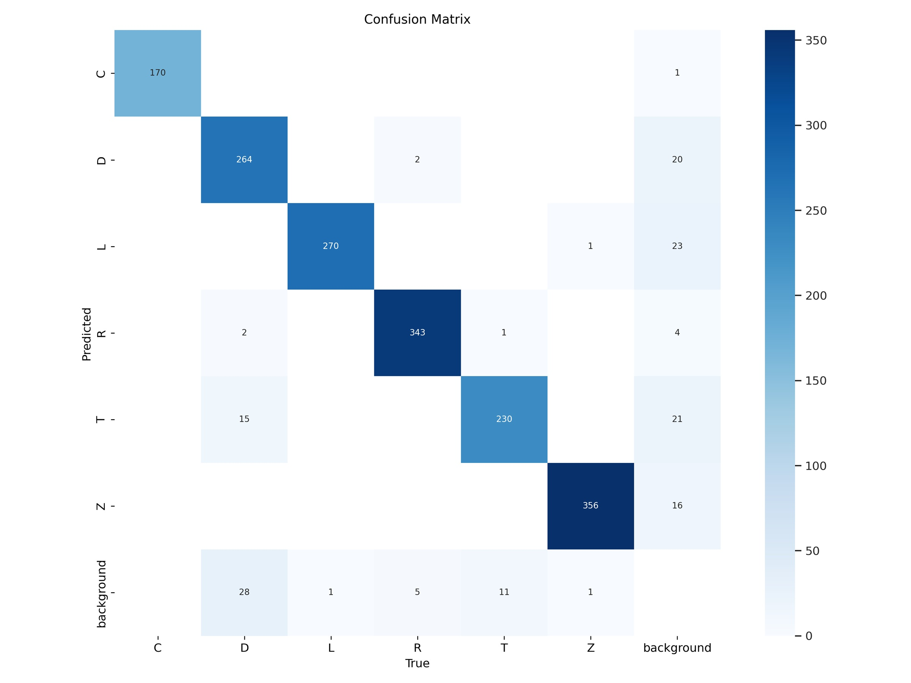

# Handwritten Electronic Schematics Analysis (Object Detection + Connection Parsing)

> **Goal.** Detect electronic components on schematic images and reconstruct their connectivity (who is wired to whom). The project explores training object detectors on a controlled, semi-synthetic dataset and converting detections into a connection matrix.


---

## Overview

We target two tasks:

1. **Object detection** of components (R, C, L, D, T, Z, ...) on schematic-like images.  
2. **Connection parsing** to infer a binary connection matrix from detected boxes (which components are connected by wires).

Given the lack of public, well-annotated datasets for hand-drawn or noisy schematics (**European style** ), we built a **semi-synthetic dataset generator** and trained detectors (Faster R-CNN and YOLOv8) on it. We also implemented a **post-processor** that turns detections into connections using classical image processing.

---

## My Role

- **Data generation (owner).** I designed and implemented the **dataset generator**: class balancing, randomized placement, photometric/geometric transforms, and the addition of wire-like strokes to train under occlusions and real-ish context. *The detailed technical description lives in the generator's subfolder; see below.*
- **Overall pipeline concept (main author).** I proposed and structured the general architecture of the system - from dataset generation and training to the post-processing stage.
- **Connection parsing (design).** I proposed the approach and criteria for the connection-matrix extractor (thresholding, morphology, edge/contour analysis, polyline approximation) and integrated it in the pipeline. **Implementation code was not mine.**

---

## System Architecture

1. **Synthetic data generator** - images + COCO annotations (classes, bboxes).  
2. **Detector training** - YOLOv8 (initialy Faster R-CNN with ResNet-50).  
3. **Connection parsing** - from detections, infer wires and produce an NxN connection matrix.

---

## Data Generation

```
Detailed generator documentation lives in `dataset_generator/README.md` (not repeated here).
```

### Motivation

As part of the task, we were required to develop an algorithm that could work with various types of data - both hand-drawn and digitally created - and on different background types. The only dataset we found contained American-style symbols. Our project supervisor suggested creating a dataset manually. However, this would involve tedious and time-consuming manual work: initially to draw the schematics, and then to annotate each object. Moreover, even if such a dataset were created, it would likely still be too small to effectively train a large neural network model.

The alternative idea was to draw individual circuit elements instead of entire schematics (initially, we also planned to draw a few full hand-drawn paths, which may still be implemented in the future). These elements can be heavily augmented using affine and perspective transformations, distortion, transparency, noise, Gaussian blur, etc. - providing scalable and varied augmentation possibilities. This approach also enables easy placement of components on different background types without redrawing them - expanding the image dataset is sufficient. In this way, a large and diverse dataset can be created semi-automatically. If an error is later discovered, the dataset can be regenerated fully automatically without repeating the drawing process.

Moreover, building such a generator is significantly more interesting from an educational standpoint.

Initially, two concepts for the final training images were considered:
- Generating realistically looking schematic diagrams (without physical validity),
- Random placement of elements on backgrounds.

We agreed to start with the simplified version, and scale up to full schematics if model performance was unsatisfactory. Ultimately, due to extreme time pressure, we made a major compromise - generating random lines extending from the "pins" of components using OpenCV.

**Key Features**
-The generator supports placing both labeled and unlabeled elements to improve model robustness.
-The constituent components are split across train/test/val sets without repetition.
-A high number of generation parameters can be configured.
-The algorithm outputs both image files and .json annotations in COCO format - ready for training pipelines.
-Besides of augmenting objects, overal images are augmented too: blur, lighting, salt-and-pepper noise

**Key Decisions and Compromises**
- The original idea of randomly scattering components on a background turned out to be ineffective - model performance dropped drastically when elements were connected. Due to time constraints, a quick workaround was implemented: lines were drawn from the "pins" of components using a rudimentary logic, with basic collision avoidance. While far from optimal, this significantly improved detection quality.
- "Pins" were defined as the leftmost and rightmost points of a component. This approach failed for transistor-like elements ("T" class), for which the pins were instead manually marked using green indicators on images.
- The algorithm is poorly optimized in terms of performance. The transformation search relies heavily on brute-force trial-and-error.

Both major compromises should be addressed in future development.

<table>
  <tr>
    <td>
      <b>Example of image of class "C"</b><br>
      
    </td>
    <td>
      <b>Example of image of no class</b><br>
      
    </td>
  </tr>
  <tr>
    <td>
      <b>Example of background image</b><br>
      
    </td>
    <td>
      <b>Example of image of class "L"</b><br>
      
    </td>
  </tr>
</table>

Example of what happened, when the model was trained without added lines: on the left - initial prediction, on the right - prediction after joining objects randomly.


Image with generated lines:


**Note: Dataset not included in the repository. Please contact the author if needed.**
---

## Detection 

### Used architectures

In the beginning we used **Faster R-CNN (ResNet-50)**: Training settings were kept standard (no exotic tricks). Due to poor performance, we moved to  **YOLOv8** trained on ready to use  [Python SDK](https://github.com/hero/YOLOv8),

### Training and Validation Metrics

Training and validation plots provide information about the model's performance over 20 epochs:


Training and validation plots provide information about the model's performance over 20 epochs:
Box loss for both training and validation systematically decreases, which means the model improves its bounding box predictions over time.
Classification loss significantly decreases in both training and validation, showing that the model is becoming more accurate in classifying objects.
Distribution loss also systematically decreases, suggesting improvement in distribution prediction.

On the other hand, looking at the metrics, we can observe that precision increases significantly, reaching a high value at the end of training, which means fewer false positive results.
Recall also shows significant improvement, reaching high values, which suggests fewer false negative results.
Average precision for 50% IoU improves systematically, indicating better overall detection performance.
The mAP50-95 metric, which is more rigorous, also shows significant improvement, indicating better performance at various IoU thresholds.

| Class | Images  | Instances |Box (P | R     | mAP50 | mAP50-95) |
|:------|----------------:|-----------------:|:------:|:-----:|:-------:|:------------:|
| **all** | 300             | 1700             | 0.963  | 0.955 | 0.978   | 0.861        |
| **C**   | 135             | 170              | 0.997  | 1.000 | 0.995   | 0.891        |
| **D**   | 203             | 309              | 0.943  | 0.854 | 0.940   | 0.800        |
| **L**   | 194             | 271              | 0.967  | 0.978 | 0.993   | 0.885        |
| **R**   | 219             | 350              | 0.983  | 0.975 | 0.994   | 0.922        |
| **T**   | 176             | 242              | 0.915  | 0.926 | 0.950   | 0.772        |
| **Z**   | 217             | 358              | 0.973  | 0.996 | 0.994   | 0.897        |

```
Speed: 0.7ms preprocess, 22.2ms inference, 0.0ms loss, 6.1ms postprocess per image
```

The YOLO model shows strong and systematic improvements in performance on both the training and validation sets.
Losses in all categories (box, classification, distribution) decrease significantly, indicating improvement in object prediction and classification.
Precision, recall, and mAP metrics show significant improvement, confirming that the model is getting better at detecting and classifying objects over the course of the epochs.

Considering the numerical values, it is clearly visible that the model achieves high performance and generalizes well to new data.


### Confusion matrix

The confusion matrix below presents the classification results of the model.
It shows that most classes were correctly classified with high accuracy, indicating fairly strong performance of the classifier.
Some misclassifications occurred, primarily involving confusion with the 'background' class. This may suggest the need for further training or more advanced image preprocessing to better highlight the relevant circuit elements.

  

- Class C: 99.42%
- Class D: 84.08%
- Class L: 91.22%
- Class R: 98.56%
- Class T: 85.82%
- Class Z: 95.70%
- Background: 94.93%

### Visualization

Visualization of results on real data:


---

## Connection Parsing (post-processing)

The connection extraction procedure consists of the following steps:

1. Load bounding boxes from the annotation file. 
1. Load the corresponding image and convert bounding box coordinates from normalized values to absolute pixel positions.
1. Draw bounding boxes and their indices on the image.
1. Preprocess the image by converting it to grayscale, applying histogram equalization, and thresholding using Chen’s method.
1. Apply binary thresholding, morphological dilation, and Canny edge detection to extract edge features.
1. Find and draw contours on the image.
1. Initialize a connection matrix to track connections between bounding boxes based on contour intersections. 
1. For each contour, approximate it with a polyline and determine which bounding boxes it connects. 
1. Display the image with bounding boxes and contours, and print the resulting connection matrix.

**Observed behavior (our data):**
- Average correctness around 92% on simpler layouts; with >= 6 components per image, around **84%** (accuracy drops with clutter and near-colinear wires).
- Algorithm does not work when the background is squared or lined paper!


```
Connection matrix:
[[0 1 1 0]
 [1 0 1 1]
 [1 1 0 1]
 [0 1 1 0]]
```

---

## Limitations & Next Steps

- **Synthetic-real gap.** Detectors trained only on our generator can degrade on real-like samples (hand-drawn variability, wire styles, text labels, symbol fonts). Mixing in real fragments and domain-specific augmentations helps, but this is not production-ready yet.
- **Co-linearity edge cases.** Wires aligned with symbol strokes can elongate boxes and confuse adjacency logic; more realistic wire rendering and symbol-aware masking should help.
- **Parsing under heavy clutter.** Accuracy drops as component count rises; topology-aware post-processing and graph constraints are planned.

**Planned:**
- Broaden wire synthesis (thickness tied to symbol font, motion blur, tapered strokes).  
- Optional segmentation masks (beyond boxes) to stabilize wire/symbol separation.  
- Graph-based refinement with learned edge scoring.

---

## Repo Structure

```
.
|- dataset_generator/           # code + detailed README for synthetic data (my component)
|- faster-rcnn/                 # training code
|- connection_parsing/          # post-processing code
|-img/                          # figures used in this README
|-README.md
|-.gitignore
```

---

## Setup

- See each subfolder's README for exact environment and commands.


