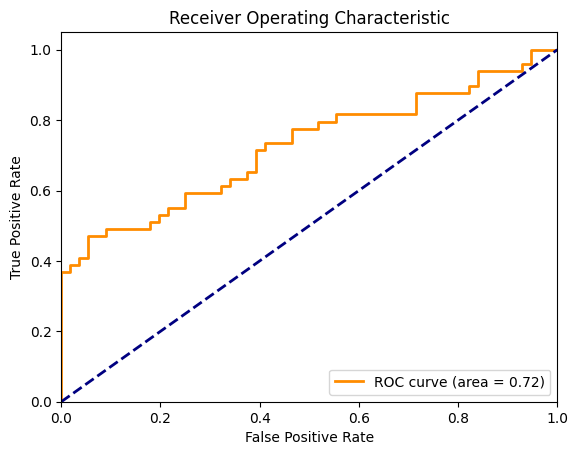
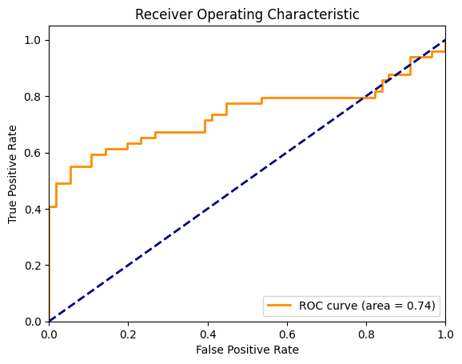
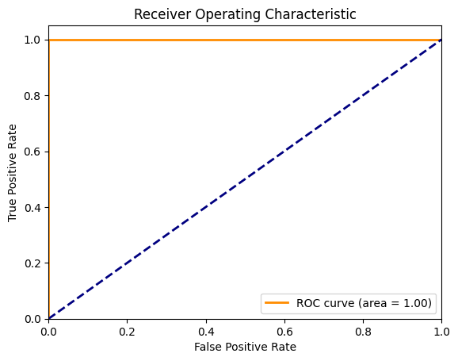
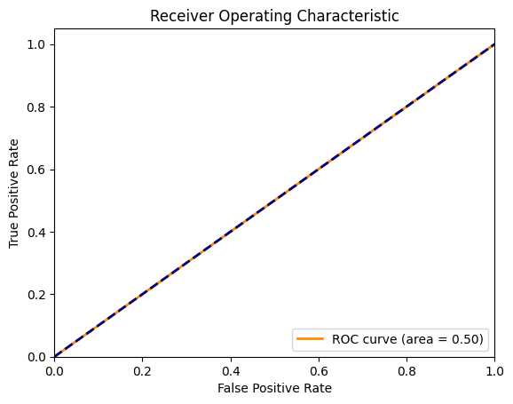
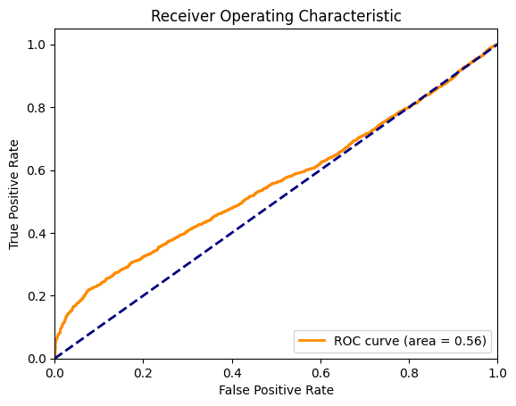
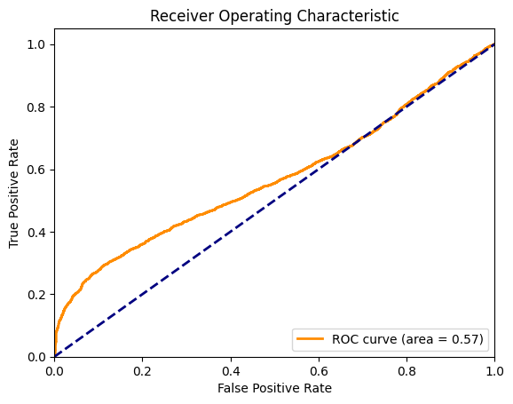
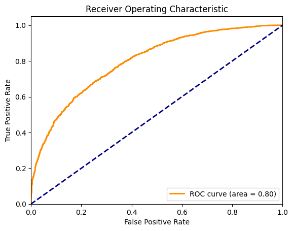

## Balabit Mouse Dynamics Challenge

The **Balabit Mouse Dynamics Challenge** dataset contains raw mouse movement logs within sessions: *timestamp*, cursor position, and button state. The data is split into **training** and **test** parts.  
The training set comprises session subsets for ten users (IDs: 7, 9, 12, 15, 16, 20, 21, 23, 29, 35); each session belongs to its corresponding user.  
In the test set, some sessions were performed by **unauthorized** users; labels for a subset of these sessions are provided in a CSV file — this was used to construct the test set in the project.

---

## Overall Approach

The goal was to select **one user** and build a detector for that user using classic ML algorithms.  
Models were trained to classify this user’s actions as **authorized (0)** and actions from all other users as **unauthorized/anomalies (1)**.

- **Training:** classification of individual **actions** (after segmentation).  
- **Testing:** evaluation per **action** and per **session** (session score = average of its action-level scores).

**Pipeline:**  
1. **Segmentation** of sessions into actions and extraction of **37 features** (following [1]).  
2. **Normalization** of numerical features w.r.t. the reference user (StandardScaler); the categorical *action_type* is **one‑hot encoded**.  
3. **Persistence**: processed data saved to `.pkl` files (per user) and reused across experiments.

**Thresholding / Hyperparameters:**  
- **Unsupervised:** *fixed‑FPR thresholding* (target false positive rate at the action level).  
- **Supervised:** tuned by **ROC‑AUC** using a validation set that includes a small portion of unauthorized users (≈10% of the overall training set) to preserve class imbalance.

**Evaluation:** on the standard test split (contains both authorized and unauthorized) using **ROC‑AUC** and **PR‑AUC**.

---

## Segmentation and Features (37)

Segmentation and feature definitions follow [1]. In total **37 features** were computed, including:

- **Statistics (mean, std, min, max)** for:  
  velocities (*vx*, *vy*, overall *v*), acceleration, angular velocity, curvature, and **jerk**.  
- **Action duration.**  
- **Trajectory length.**  
- **Start‑to‑end distance.**  
- **Action direction** (angle).  
- **Straightness** (*d*<sub>straight</sub> / trajectory length).  
- **Number of points** in an action.  
- **Sum of angles.**  
- **Initial acceleration.**  
- **Action type** (*MM* – Mouse Move, *PC* – Point Click, *DD* – Drag and Drop) — **categorical** (one‑hot).

**Data cleaning:**  
- duplicates removed,  
- scroll‑wheel events filtered out (per [1], ~42% of test sessions contain this attribute),  
- where the time derivative equals 0, values are approximated from neighbors; if all derivatives are 0, the action is discarded,  
- actions with fewer than **5 points** are discarded.

**Processing:**  
- **Continuous** features → **StandardScaler** (fit on the reference user’s data),  
- **action_type** → **one‑hot**; a consistent set of one‑hot columns is maintained between train/test (reindexing as needed),  
- data saved per user to `.pkl` files.

> Note: for pipeline consistency, standardization was applied globally; not all models strictly require it (e.g., Isolation Forest, XGBoost), but we kept a uniform input format.

---

## Algorithms Used

**Unsupervised:**  
- **K‑means** — anomaly score: distance to the nearest centroid. (Input: numerical features; *action_type* can be one‑hot, but in practice centroid locations often capture action‑type patterns via correlated motion features.)  
- **Isolation Forest** — anomaly detection by isolation; input must be **numeric** (categories via one‑hot). Does not require scaling.

**Supervised:**  
- **XGBoost** — binary classification (0/1); works well without strict scaling, but categories must be numeric.  
- **SVM** (*poly*, *rbf*) — requires scaling; no native categorical support → one‑hot.

**Additional techniques:**  
- **PCA** — dimensionality reduction (primarily tested with K‑means and SVM).  
- **SMOTE** — class balancing (alternative to *class_weight*).  
- **K‑fold** — cross‑validation where appropriate (with care to split by session).

---

## Grid Search (default ranges)

```yaml
K_means:
  param_grid:
    n_clusters: [1, 2, 3, 4, 5, 6, 7, 8]
    n_components: [4, 16, 24, 32, null]   # PCA; null = no PCA
    whiten: [true]                         # applies to PCA stage

Isolation_forest:
  param_grid:
    n_components: [null]
    n_estimators: [32, 64, 100, 192]
    max_samples: [0.1, 0.4, 0.7, 1.0]
    max_features: [0.5, 0.75, 1.0]
    bootstrap: [true, false]
    alpha: [0.2]                           # target FPR (fixed-FPR)

XGBoost:
  param_grid:
    n_components: [null]
    max_depth: [3, 6, 9]
    learning_rate: [0.01, 0.1, 0.2]
    n_estimators: [50, 100, 200]
    max_leaves: [8, 16, 32, 64, 128]
    balancing: [proportional, SMOTE]

SVM:
  param_grid:
    n_components: [32, null]
    kernel: [poly, rbf]
    balancing: [proportional, SMOTE]
```

> In practice, it’s cleaner to configure PCA/whitening at the **pipeline level** rather than per‑model (ensures consistent experiments).

---

## Statistical Analysis of the Dataset

Both the train and test splits contain three action types: **MM**, **PC**, **DD**.  
In the training split: ~**21%** MM, **68%** PC, **11%** DD (test shows very similar proportions).  
Average number of actions per **training** session ≈ **940** (min 237, max 2488).  
**Test** sessions are shorter: average **50** actions (min 4, max 175).

---

## Preparing the Dataset for Experiments

The target user is treated as **authorized**. All of this user’s sessions are saved as the **training set**.  
Continuous features are standardized using **StandardScaler** (fit on the target user); the scaler object is saved and reused consistently in subsequent stages (train/val/test).  
Validation and test sets are formed by adding actions/sessions from other users in controlled proportions (validation ≈ **10%** “unauthorized” within the training process for supervised models).

---
## Best configurations

```yaml
K-means:
    "n_clusters": 2
    "n_components": 15

Isolation_forest:
    "bootstrap": true
    "max_features": 1.0
    "max_samples": 0.1
    "n_estimators": 64

XGBoost:
    "balancing": "proportional"
    "learning_rate": 0.1
    "max_depth": 9
    "max_leaves": 32
    "n_estimators": 200

SVM:
    "n_components": 32
    "kernel": "rbf"
    "balancing": "SMOTE"
```

---

## ROC results

Based on results from [1] for testing, data od **user12** was chosen.

### Per session
<table>
  <tr>
    <td>
      <b>K-means</b><br>
      
    </td>
    <td>
      <b>Isolation forest</b><br>
      
    </td>
  </tr>
  <tr>
    <td>
      <b>XGBoost</b><br>
      
    </td>
    <td>
      <b>SVM</b><br>
      
    </td>
  </tr>
</table>

### Per action

<table>
  <tr>
    <td>
      <b>K-means</b><br>
      
    </td>
    <td>
      <b>Isolation forest</b><br>
      
    </td>
  </tr>
  <tr>
    <td>
      <b>XGBoost</b><br>
      
    </td>
    <td>
      <b>SVM</b><br>
      
    </td>
  </tr>
</table>

> Results of both XGBoost raised initial suspition, but further investigation proved that the results are reliable.

---

## Conclusions
- Both unsupervised methods (K-means, Isolation Forest) were useful for anomaly detection, especially at the session level. However, classification per action showed very low precision, which confirms that more aggregated data is necessary to obtain stable performance.
- XGBoost consistently achieved very high AUC values. While initially surprising, these results are consistent with [1] and can be explained by the model’s supervised nature, ability to handle categorical features, and capacity to capture non-linear relationships. In this context, the performance is credible rather than suspicious.
- SVM generally struggled to capture the structure of the data, even when kernel functions were applied. In some cases (e.g., user7) results were better, which suggests that the method may occasionally align with a particular user’s data distribution. Overall, however, SVM proved unstable and less effective compared to other approaches.
- PCA improved results for both K-means and SVM. This indicates that PCA successfully reduced noise.
- For XGBoost, proportional balancing provided better results than SMOTE, suggesting that proportional resampling better preserved the natural structure of the dataset.
- For SVM SMOTE improved results, however the difference was not significant.
- It is important to note that PR AUC values are not centered around 0.5 as in ROC, but instead depend on the proportion of positive samples in the dataset. For example, when positives account for ~75% of the data, even a random classifier will yield a PR AUC of about 0.75. This explains why high PR AUC values may appear alongside low ROC AUC values.

---
## References

**[1]**: https://arxiv.org/pdf/1810.04668
